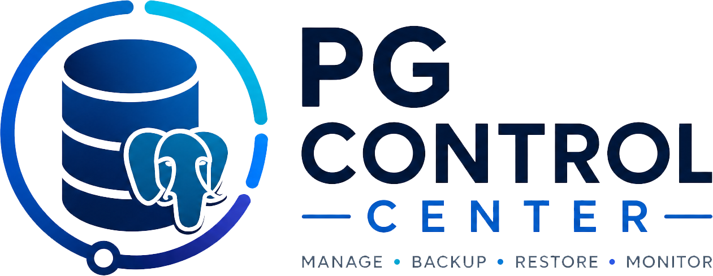

<p align="center">
  
</p>

# StageBridge AI


**An AI-powered control center for PostgreSQL fleets.** Deterministic code computes the facts — schema diffs, backup state, diagnostics — and OpenAI explains the risks and builds a safe, step-by-step plan. **Advisory by design: the AI never executes anything.**

> Built for the OpenAI hackathon. A working, live product — not a mockup.

**Stack:** FastAPI · Celery · RabbitMQ · Redis · PostgreSQL · MinIO/S3 · Vue 3 + PrimeVue · OpenAI · Docker Compose
**Languages:** the entire UI ships in **Kazakh 🇰🇿 / Russian 🇷🇺 / English 🇬🇧** (vue-i18n, switch live in the top bar).

---

## Why

Every team running PostgreSQL hits the same scary moment: pushing a structure change from `test` to `prod`, restoring a backup, or refreshing staging from production. One wrong `ALTER` and you lose data or break the app. Existing admin tools show you *what* changed — not *whether it's safe* or *in what order to apply it*. That judgment lives in a senior DBA's head.

StageBridge AI puts that judgment into the tool — using an LLM the right way: **on top of hard facts, not vibes.**

## The AI layer (ten touchpoints)

1. **AI migration plan** — for a structure-sync dry-run, the AI reads the generated SQL diff and returns an overall risk level, concrete risks (e.g. a new `UNIQUE` constraint failing on existing duplicate rows), a **safe apply order**, and a **rollback plan**.
2. **AI assistant** — a floating panel on every screen; ask *"how do I safely move structure from test to prod?"* and get a practical, PostgreSQL-aware answer.
3. **AI diagnostics analysis** — after a server health check, the AI classifies severity, says what's wrong (missing roles, ACL issues), and recommends fixes.
4. **AI backup risk analysis** — before a restore, the AI weighs the real backup state (*"`demo_shop` has a fresh backup, `demo_prod`/`demo_test` don't → high risk"*) and lists what to check.
5. **AI Query Advisor** — from Monitoring → Slow queries, the AI reads a selected `pg_stat_statements` query and returns advisory-only optimization notes, suggested `CREATE INDEX ...` statements, and rewrite ideas.
6. **AI Lock Analyzer** — when Monitoring finds waiting locks, the AI explains blocking chains, severity, recommended investigation steps, and caveats without terminating sessions or executing SQL.
7. **AI Config Advisor** — reviews a compact PostgreSQL settings snapshot and returns advisory-only findings and tuning recommendations.
8. **AI Schema Reviewer** — reads a tenant-authorized, read-only schema snapshot and flags common design risks such as missing keys, FK/index gaps, and suspicious duplicate indexes.
9. **AI SQL Explorer** — converts a natural-language question into one read-only `SELECT`, validates it, runs it in a read-only transaction with timeout and hard `LIMIT 100`, and shows the rows.
10. **AI Audit Summary** — summarizes recent internal audit-log records within the user's organization scope, highlighting notable actions and suspicious patterns.

Every feature calls **OpenAI Chat Completions with JSON-mode structured output**, so the UI renders clean risk/steps/rollback cards instead of a wall of text. The OpenAI key is entered **in the UI (Settings → AI)** and stored **Fernet-encrypted in the database** — no `.env` edits, no restart, secrets never in plaintext.

## How Codex & GPT-5.6 were used

**GPT-5.6 in the product.** Every AI feature — migration plan, assistant, diagnostics, backup risk, Query Advisor, Lock Analyzer, Config Advisor, Schema Reviewer, SQL Explorer, and Audit Summary — calls **GPT-5.6** through the OpenAI Chat Completions API (`backend/app/services/ai_service.py`), with JSON-mode structured output so the UI renders clean cards. `gpt-5.6` is the default model, set from the UI (Settings → AI) and stored Fernet-encrypted.

**Codex built the AI Query Advisor end to end.** During the submission period I used **Codex (on GPT-5.6)** to add the fifth AI feature as a self-contained, additive change. Codex wrote:
- `ai_service.query_advisor()` — the prompt + JSON contract (`severity` / `problems` / `indexes` / `rewrite` / `notes`);
- the `/api/ai/query-advisor` FastAPI route and its request model;
- the Monitoring **"AI: Optimize"** action and the reusable `AiInsight` result card in `MonitoringView.vue`;
- `queryAdvisor.*` translations across **all three** locales (kk / ru / en).

**Engineering decisions Codex made (not just codegen):**
- Adapted `_chat()` for the GPT-5 family — `max_completion_tokens` instead of `max_tokens`, and dropping the unsupported `temperature` — with a **fallback-retry** that strips unsupported params on a 400, so the four existing AI features keep working across model families.
- UI correctness: re-creating the result card via `:key` on query change, and clearing the selected query when it drops out of the live `pg_stat_statements` snapshot on auto-refresh.

**Codex round 2.** Codex added the advisory-only Lock Analyzer, a real backend pytest suite, lean GitHub Actions CI, and read-only Query Advisor grounding through timeout-bounded `EXPLAIN (FORMAT JSON)` without `ANALYZE`. It also created an idempotent slow-query demo workload and verified the plan path against the live `demopg` container. The file-by-file record and exact checks are in [`docs/CODEX_LOG.md`](docs/CODEX_LOG.md).

**Codex round 3.** Codex added the advisory-only Config Advisor and Schema Reviewer, including tenant-authorized read-only schema collection, trilingual UI entries, backend tests, and a Vitest frontend test setup wired into CI. The file-by-file record and exact checks are in [`docs/CODEX_LOG.md`](docs/CODEX_LOG.md).

**Codex round 4.** Codex added the security-critical NL→SQL Explorer and AI Audit Summary. The SQL Explorer path is intentionally conservative: tenant authorization happens before schema collection, generated SQL is rejected unless `query_plan_service.is_explainable_query()` accepts it as a single read-only SELECT, and execution uses a dedicated read-only runner with `statement_timeout <= 3s` and hard `LIMIT 100`. Codex also added export controls to `AiInsight` (`Copy`, `Copy SQL`, `Download .md`), backend tests for the new endpoints and safe runner, and a Vitest export-button test. The file-by-file record and exact checks are in [`docs/CODEX_LOG.md`](docs/CODEX_LOG.md).

**Codex round 5.** Codex added the AI UX polish pass: structured `AiInsight` cards now show a small animated thinking state with rotating trilingual status phrases, and the floating assistant uses a three-dot typing indicator. Both paths respect `prefers-reduced-motion` and fall back to static text. Codex also added real SSE token streaming for the free-text assistant, with a client fallback to the existing non-streaming `/ai/assistant` endpoint when streaming is unavailable. The file-by-file record and exact checks are in [`docs/CODEX_LOG.md`](docs/CODEX_LOG.md).

I worked under an `AGENTS.md` guardrail file (branch isolation, additive-only edits, i18n parity, no touching migrations/backups/structure-sync). The `/feedback` Codex Session ID for this work is provided in the submission form.

**Division of labor:** the core control center, the Celery/RabbitMQ task engine, structure-sync, and the trilingual UI predate these Codex rounds. Codex was used for the later additive AI features, safety hardening, tests, CI coverage, and this documentation.

## The safety model

The AI is advisory; real work runs through controlled Celery jobs. Structure sync clones prod into a temp DB, applies the plan, **verifies row counts, waits for approval, then does an atomic rename swap** — nothing is destroyed until the very last step. Real `pg_dump` → S3/MinIO, and the app even installs the matching `postgresql-client` major version for each server on demand (from PGDG).

## Architecture

| Layer | Tech |
|------|------|
| Frontend | Vue 3 (`<script setup>`), PrimeVue, Pinia, Vite, TypeScript, vue-i18n (kk/ru/en), WebSocket for live task progress |
| Backend | FastAPI (async SQLAlchemy + asyncpg), Alembic, Pydantic v2, Fernet |
| Task engine | Celery workers over RabbitMQ; Redis pub/sub streams progress → WebSocket |
| AI | single `ai_service` → OpenAI Chat Completions (JSON mode), exposed at `/api/ai/*` |
| Storage | S3-compatible (MinIO), configured per-server from the UI |
| Deploy | Docker Compose — 9 services |

`appdb 5433 · redis 6380 · rabbitmq 5672/15672 · backend 8000 · worker · scheduler · frontend 80 · minio 9000/9001 · demopg` (demo server with sample databases).

## Quick start

```bash
cp .env.example .env
# 1) FERNET_KEY — key for encrypting stored server passwords:
#      python -c "from cryptography.fernet import Fernet; print(Fernet.generate_key().decode())"
# 2) SUPER_ADMIN_PASSWORD — set your platform admin password
#    (the admin username stays `admin`; email/username are also in .env)

docker compose up -d --build
```

Open **http://localhost** and **log in** as user **`admin`** with the **`SUPER_ADMIN_PASSWORD`** you set in `.env`. A demo PostgreSQL server with sample databases is provisioned automatically.

To enable the AI features: **Settings → AI**, paste your OpenAI API key, Save. (Stored encrypted; applied instantly, no restart.)

### Realistic slow-query demo

A fresh `demopg` volume automatically creates unindexed customer/order/event tables and warms several seq-scan and join queries. For an existing volume, refresh the demo workload and `pg_stat_statements` snapshot with:

```bash
bash scripts/seed_slow_queries.sh
```

The script is idempotent and resets statistics only inside the disposable demo PostgreSQL. Open **Demo PostgreSQL → Monitoring → Slow queries**, then run **AI: optimize query** to see advice grounded in a real `EXPLAIN (FORMAT JSON)` plan when the recorded query has no bind placeholders.

### Frontend dev (hot reload)

```bash
cd frontend && npm install && npm run dev
```

Vite proxies `/api` and `/ws` → `localhost:8000`.

## Project layout

```
backend/app/
  api/          — REST + WebSocket (incl. ai.py)
  services/     — business logic (ai_service, backup_service, schema_diff_service, …)
  tasks/        — Celery (backup, structure_sync, diagnostics, …)
  models/ schemas/ alembic/
frontend/src/
  views/        — pages
  components/   — AppLayout, TaskPanel, AiAssistant, AiInsight, LangSwitcher
  i18n/locales/ — kk.json / ru.json / en.json (full UI coverage)
  stores/       — Pinia (tasks over WebSocket)
docker-compose.yml
docs/           — DEMO.md, DEVPOST_SUBMISSION.md, pitch.html
```

## Demo & pitch

- `docs/DEMO.md` — end-to-end demo scenario.
- `docs/DEVPOST_SUBMISSION.md` — full write-up.
- `docs/pitch.html` — one-page pitch with screenshots.

## What's next

Apply selected AI suggestions through a separate approval-gated workflow · anomaly detection over the live monitoring stream · per-org AI budgets and audit trail.

## Built with

`openai` · `python` · `fastapi` · `sqlalchemy` · `celery` · `rabbitmq` · `redis` · `postgresql` · `vue` · `typescript` · `primevue` · `vite` · `docker` · `minio` · `websockets`
