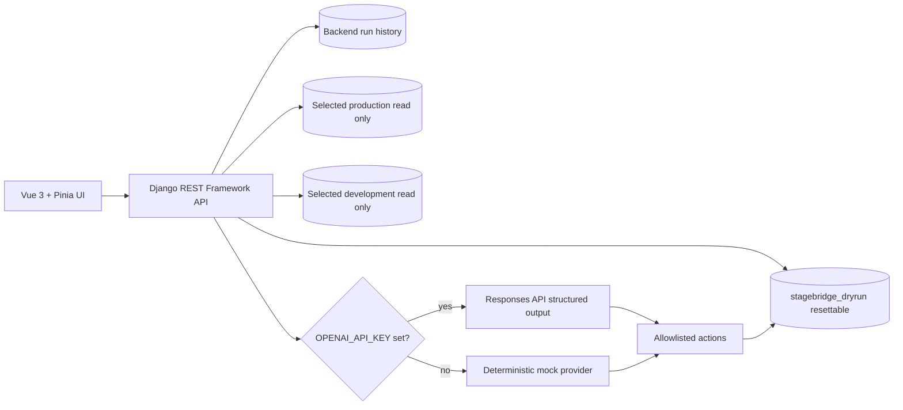

# StageBridge AI

StageBridge AI is a hackathon MVP for PostgreSQL schema compatibility analysis. It compares user-selected production and development connections, runs deterministic read-only preflight checks against production data, and produces an advisory OpenAI or deterministic mock remediation report. The original seeded six-conflict demo and isolated demo dry run remain available.

## Architecture



## Features

- PostgreSQL catalog inspection for schemas, tables, columns, constraints, indexes, enums, and sequences.
- Saved production, development, and staging connection profiles with test status and selected schemas.
- Generic deterministic diffing for tables, columns, defaults, keys, constraints, indexes, enums, and sequences.
- Preflight data checks for:
  - nullable to `NOT NULL`;
  - text to numeric and integer incompatibility;
  - varchar length reduction and enum value removal;
  - new foreign key orphan rows;
  - new unique constraint duplicates;
  - probable column rename.
- Strict Pydantic remediation plan model.
- OpenAI Responses API integration when `OPENAI_API_KEY` and `OPENAI_MODEL` are set.
- Deterministic mock AI provider when no API key is configured.
- Action allowlist with backend-controlled SQL previews.
- Isolated dry-run workflow with transfer/rejection counts and execution logs.
- Vue dashboard, connection overview, analysis flow, conflict details, approvals, dry-run timeline, and final report.

## Safety Model

- Production and development connections are configured read-only.
- Production queries use statement timeouts and sampled output.
- SQL identifiers are validated and quoted with `psycopg.sql` in preflight checks.
- AI output is advisory and validated before persistence.
- Unknown action types are rejected.
- The dry run writes only to `stagebridge_dryrun`.
- No database passwords are returned by the API.
- Live analysis never executes DDL or DML against user databases.

## Prerequisites

- Docker Desktop with Linux containers.
- Node.js 22 for local frontend commands.
- Python 3.12 for the target backend runtime. The Docker backend image uses Python 3.12.

## Quick Start

```powershell
docker compose up --build
```

Open:

- UI: `http://localhost:5173`
- API health: `http://localhost:8000/api/health/`
- PostgreSQL host port: `localhost:55432`

The live flow:

1. Open Connections and add production and development profiles.
2. Test both profiles and save the schemas to inspect.
3. Open New analysis, choose the profiles and schemas, and run live analysis.
4. Review structural differences, affected rows, sampled values, and SQL previews.
5. Generate the AI plan and export Markdown or JSON.

Use **Run demo analysis** for the seeded six-conflict flow and isolated dry run.

To reset seeded PostgreSQL databases:

```powershell
docker compose down -v
docker compose up --build
```

## Environment

Copy `.env.example` to `.env` for local overrides. Important values:

- `OPENAI_API_KEY`: optional. Empty uses the deterministic mock provider.
- `OPENAI_MODEL`: required only when `OPENAI_API_KEY` is set.
- `POSTGRES_HOST`, `POSTGRES_PORT`, `POSTGRES_USER`, `POSTGRES_PASSWORD`.
- `PROD_DB_*`, `DEV_DB_*`, `STAGE_DB_*`, `DRYRUN_DB_*`.
- `PG_STATEMENT_TIMEOUT_MS`.
- `ALLOW_EXTERNAL_DB_HOSTS`: defaults to `0`, allowing only local/Docker demo hosts.

## Test Commands

```powershell
.\.venv\Scripts\python -m pytest
.\.venv\Scripts\python backend\manage.py check
cd frontend
npm run typecheck
npm run build
```

Windows helper:

```powershell
.\scripts-dev.ps1 test-backend
.\scripts-dev.ps1 typecheck-frontend
.\scripts-dev.ps1 build-frontend
.\scripts-dev.ps1 compose-up
```

## API Overview

- `GET /api/health/`
- `GET /api/connections/`
- `POST /api/connections/`
- `PATCH|DELETE /api/connections/{id}/`
- `POST /api/connections/{id}/test/`
- `POST /api/connections/test/`
- `GET /api/analysis/`
- `POST /api/analysis/run/`
- `GET /api/analysis/{id}/`
- `POST /api/analysis/{id}/ai-plan/`
- `PATCH /api/analysis/{id}/actions/`
- `POST /api/analysis/{id}/dry-run/`
- `GET /api/analysis/{id}/report/`

## Demo Result

The seeded demo detects six conflicts, five blocking issues, and nine affected rows. With all mock-recommended actions approved, the dry run passes with eight transferred rows, three rejected rows, and zero validation failures.

## Known Limitations

- Connection-profile passwords are stored unencrypted at rest in the backend database for this hackathon MVP. Use a dedicated low-privilege read-only database user and do not deploy this storage model to production.
- The dry-run loader remains intentionally limited to the seeded demo schemas; live analyses are report-only.
- Structural changes without a bounded generic data query are labeled `unsupported_preflight` for manual review.
- Action editing is intentionally minimal in the UI.
- Real OpenAI calls require a model available to the user's account.
- The MVP uses Django development serving in the backend container.

## Roadmap

- Move connection credentials to an encrypted secret store.
- Broader PostgreSQL type compatibility matrix.
- Constraint dependency ordering for arbitrary schemas.
- Full action parameter editing and approval audit exports.
- Background jobs for long-running analysis and dry runs.
- Role-based access control and SSO.
