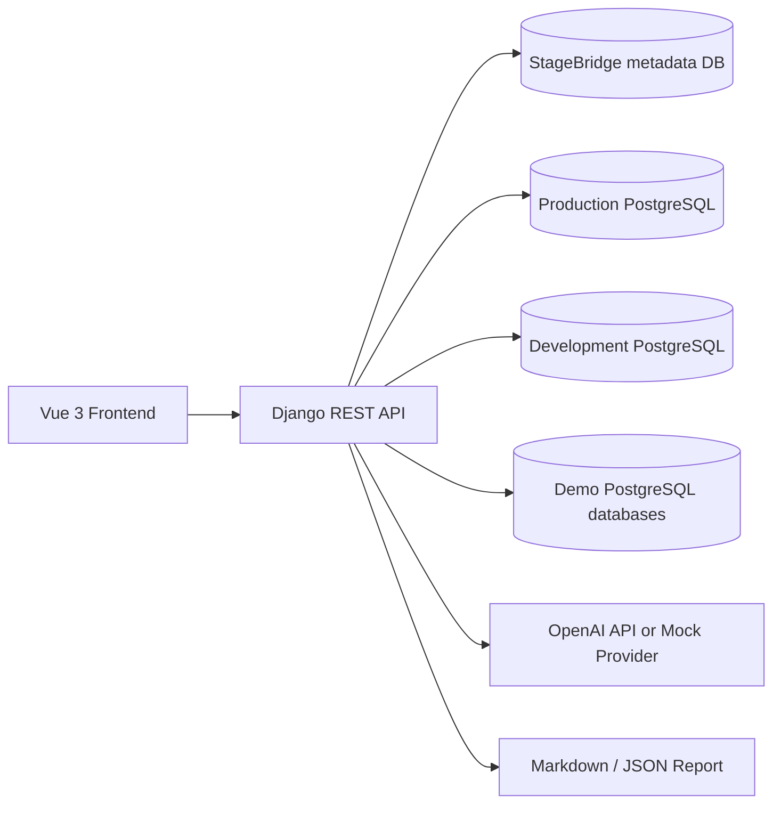

# StageBridge AI — полное техническое задание

## 1. Назначение проекта

**StageBridge AI** — веб-приложение для анализа совместимости PostgreSQL-баз перед обновлением staging-среды данными из production.

Система должна:

1. Подключаться к реальным PostgreSQL-базам.
2. Сравнивать production-схему и development-схему.
3. Находить изменения, способные сломать импорт production-данных.
4. Проверять реальные production-данные безопасными read-only запросами.
5. Объяснять найденные проблемы.
6. Формировать безопасный план исправления.
7. Генерировать контролируемый SQL-план.
8. Экспортировать отчёт.
9. Сохранять существующий демонстрационный сценарий.
10. Не выполнять разрушительные операции над реальными базами.

Проект должен быть полезен не только как демонстрация для хакатона, но и как основа самостоятельного PostgreSQL-инструмента.

---

# 2. Главная пользовательская проблема

Обычный процесс обновления staging выглядит так:

```text
production data
        ↓
pg_dump / pg_restore
        ↓
staging with development schema
```

Процесс ломается, когда development-схема уже отличается от production:

- добавлена колонка `NOT NULL`;
- изменён тип колонки;
- уменьшена длина `VARCHAR`;
- удалены значения `ENUM`;
- добавлен внешний ключ;
- добавлен уникальный индекс;
- удалена или переименована колонка;
- добавлено ограничение `CHECK`;
- изменены таблицы, индексы или последовательности.

StageBridge AI должен находить такие проблемы **до выполнения restore**.

---

# 3. Границы продукта

## 3.1 Что входит в текущую версию

Текущая версия должна реализовать:

- подключение к произвольным PostgreSQL-базам;
- профили подключений;
- проверку подключения;
- выбор production и development;
- выбор PostgreSQL-схем;
- детерминированное сравнение схем;
- безопасные preflight-проверки production-данных;
- классификацию изменений;
- AI или mock-анализ;
- контролируемые рекомендации;
- SQL preview;
- экспорт Markdown и JSON;
- локализацию на казахский, русский и английский;
- встроенный demo-режим;
- существующий изолированный dry run только для demo-режима.

## 3.2 Что не входит в текущую версию

Не реализовывать:

- автоматический `pg_dump` реальных баз;
- автоматический `pg_restore` реальных баз;
- выполнение AI-сгенерированного произвольного SQL;
- запись в production;
- изменение development;
- автоматическое исправление реальных данных;
- шифрованное хранилище секретов enterprise-уровня;
- команды для MySQL, MSSQL и Oracle;
- Kubernetes;
- RabbitMQ;
- Celery;
- расписания;
- Telegram и Slack;
- сложную многопользовательскую авторизацию;
- биллинг;
- полноценную миграционную систему.

Главный принцип: **лучше полностью работающий анализатор, чем недоделанный автоматический мигратор**.

---

# 4. Текущий стек

## Frontend

- Vue 3
- TypeScript
- Vite
- Pinia
- Vue Router
- Axios
- Vue I18n

## Backend

- Python 3.12
- Django 5
- Django REST Framework
- psycopg 3
- Pydantic
- OpenAI Python SDK
- pytest
- pytest-django

## Infrastructure

- PostgreSQL 17
- Docker Compose

Не менять стек без объективной необходимости.

---

# 5. Архитектура



## 5.1 Архитектурный принцип

Разделить систему на независимые слои:

1. **Connection management**
2. **Schema inspection**
3. **Schema normalization**
4. **Diff engine**
5. **Preflight checks**
6. **Conflict classification**
7. **AI advisory layer**
8. **Controlled action layer**
9. **Report generation**
10. **Demo dry-run layer**

AI не должен определять фактические различия схем. Это делает только детерминированный код.

---

# 6. Структура репозитория

Сохранить monorepo:

```text
StageBridgeAI/
├── backend/
│   ├── manage.py
│   ├── stagebridge/
│   ├── analysis/
│   ├── connections/
│   ├── reports/
│   ├── requirements.txt или pyproject.toml
│   └── Dockerfile
├── frontend/
│   ├── src/
│   │   ├── api/
│   │   ├── components/
│   │   ├── views/
│   │   ├── stores/
│   │   ├── router/
│   │   ├── i18n/
│   │   └── types/
│   ├── package.json
│   └── Dockerfile
├── infrastructure/
│   └── postgres/
│       └── init/
├── demo/
├── docs/
├── docker-compose.yml
├── .env.example
├── .gitignore
├── README.md
└── LICENSE
```

Не переносить существующие файлы без необходимости.

---

# 7. Режимы работы

Система должна иметь два явно разделённых режима.

## 7.1 Demo mode

Назначение:

- быстро показать работу судьям;
- не требовать внешних баз;
- не требовать OpenAI API key;
- выполнять существующий сценарий с шестью подготовленными конфликтами;
- поддерживать изолированный dry run.

В интерфейсе обязательно показывать:

```text
DEMO DATA
```

или локализованный эквивалент.

## 7.2 Live database analysis

Назначение:

- анализ реальных PostgreSQL-баз;
- production и development выбираются пользователем;
- доступ только на чтение;
- результатом является анализ, рекомендации и отчёт;
- никаких изменений реальных баз.

В интерфейсе обязательно показывать:

```text
LIVE DATABASE ANALYSIS
```

или локализованный эквивалент.

Нельзя смешивать demo-результаты и live-результаты.

---

# 8. Профили подключений

## 8.1 Модель ConnectionProfile

Поля:

```text
id
name
role
host
port
database
username
password
sslmode
selected_schemas
statement_timeout_ms
is_demo
created_at
updated_at
last_tested_at
last_test_status
```

## 8.2 Допустимые роли

```text
production
development
staging
```

## 8.3 Поля формы

- Название подключения
- Роль
- Host
- Port
- Database
- Username
- Password
- SSL mode
- Statement timeout
- Выбранные схемы

## 8.4 SSL mode

Поддержать:

```text
disable
allow
prefer
require
verify-ca
verify-full
```

## 8.5 Правила безопасности

1. Пароль никогда не возвращается API.
2. Пароль не показывается после сохранения.
3. Пустой password при редактировании означает «не менять».
4. Connection string не возвращается frontend.
5. Ошибки не должны содержать пароль.
6. Production и development открываются read-only.
7. Устанавливается `statement_timeout`.
8. Для MVP разрешено хранение пароля в базе без enterprise-шифрования, но это ограничение явно указать в README.
9. Внешние host разрешать только при:

```text
ALLOW_EXTERNAL_DB_HOSTS=1
```

10. При выключенной настройке разрешить только:
   - `localhost`
   - `127.0.0.1`
   - Docker service names
   - явно заданный allowlist

---

# 9. Экран Connections

URL:

```text
/connections
```

## 9.1 Список профилей

Показывать:

- название;
- роль;
- host;
- port;
- database;
- SSL mode;
- последний статус проверки;
- дату последней проверки;
- признак demo.

Действия:

- Add connection
- Test
- Edit
- Delete

## 9.2 Проверка подключения

Кнопка `Test connection` должна:

1. Подключиться к базе.
2. Установить timeout.
3. Выполнить:

```sql
SELECT current_database(), current_user, version();
```

4. Получить список доступных пользовательских схем.
5. Проверить возможность read-only транзакции.
6. Вернуть понятный результат.

Успешный ответ:

```json
{
  "success": true,
  "database": "app_db_prod",
  "server_version": "17.x",
  "schemas": ["public", "documents"]
}
```

Ошибка:

```json
{
  "success": false,
  "code": "invalid_credentials",
  "message": "Connection failed"
}
```

---

# 10. Создание анализа

URL:

```text
/analysis/new
```

## 10.1 Поля

- Production profile
- Development profile
- Production schemas
- Development schemas
- Ignore schemas
- Ignore tables
- Run preflight checks
- Analysis name

## 10.2 Валидация

- production и development обязательны;
- нельзя выбрать один профиль одновременно как production и development;
- должны быть выбраны минимум по одной схеме;
- demo-профиль нельзя случайно смешать с live-профилем;
- staging для live-анализа необязателен.

---

# 11. Schema inspector

Schema inspector должен работать с произвольными пользовательскими схемами.

## 11.1 Извлекаемые объекты

- schemas;
- tables;
- columns;
- ordinal positions;
- data types;
- underlying PostgreSQL types;
- nullability;
- defaults;
- generated columns;
- identity columns;
- primary keys;
- foreign keys;
- unique constraints;
- check constraints;
- indexes;
- enum types;
- enum values;
- sequences;
- ownership where relevant.

## 11.2 Не анализировать

По умолчанию исключить:

```text
pg_catalog
information_schema
pg_toast
```

## 11.3 Нормализация

Перед сравнением привести метаданные к стабильной структуре:

```json
{
  "schema": "public",
  "table": "users",
  "columns": [],
  "constraints": [],
  "indexes": []
}
```

Порядок объектов должен быть детерминированным.

---

# 12. Diff engine

Diff engine не использует AI.

## 12.1 Поддерживаемые изменения

### Таблицы

- added_table
- removed_table

### Колонки

- added_column
- removed_column
- probable_column_rename
- changed_data_type
- changed_nullability
- changed_default
- changed_varchar_length
- changed_identity
- changed_generated_expression

### Constraints

- added_primary_key
- removed_primary_key
- changed_primary_key
- added_foreign_key
- removed_foreign_key
- changed_foreign_key
- added_unique_constraint
- removed_unique_constraint
- added_check_constraint
- removed_check_constraint
- changed_check_constraint

### Indexes

- added_index
- removed_index
- changed_index

### Enums

- added_enum_value
- removed_enum_value
- changed_enum_order

### Sequences

- added_sequence
- removed_sequence
- changed_sequence

## 12.2 Серьёзность

Каждый diff получает:

```text
safe
warning
blocking
unknown
```

Примеры:

- добавление nullable-колонки — `safe`;
- `NULL → NOT NULL` — `blocking`;
- удаление колонки — `warning` или `blocking`;
- изменение `VARCHAR → NUMERIC` — `blocking`;
- новый индекс без unique — `safe`;
- новый unique constraint — `blocking`.

---

# 13. Модель SchemaDiff

Каждая запись должна содержать:

```json
{
  "id": "uuid",
  "category": "changed_nullability",
  "severity": "blocking",
  "schema": "public",
  "table": "users",
  "column": "phone",
  "object_name": null,
  "production_definition": {},
  "development_definition": {},
  "summary_code": "column_became_not_null",
  "supports_preflight": true,
  "created_at": "..."
}
```

Пользовательские сообщения не хранить как единственный источник истины. Хранить стабильные коды.

---

# 14. Preflight checks

Preflight выполняется только против production и только read-only.

## 14.1 Общие правила

1. Использовать `psycopg.sql.Identifier`.
2. Не вставлять table/column names через f-string.
3. Ограничивать sample rows.
4. Использовать statement timeout.
5. Не выполнять DDL.
6. Не выполнять UPDATE, DELETE, INSERT.
7. Не выполнять пользовательский произвольный SQL.
8. Записывать duration и статус проверки.

## 14.2 Поддерживаемые проверки

### NULL → NOT NULL

```sql
SELECT COUNT(*)
FROM <table>
WHERE <column> IS NULL;
```

### TEXT/VARCHAR → INTEGER

Проверить значения, не приводимые к integer.

### TEXT/VARCHAR → NUMERIC

Проверить значения, не приводимые к numeric.

### Уменьшение VARCHAR

Проверить:

```sql
char_length(column) > new_limit
```

### Новый UNIQUE

Найти группы дубликатов.

### Новый FOREIGN KEY

Найти orphan rows.

### Удалённые ENUM values

Найти используемые production-значения, которых нет в development.

### Новый CHECK

Если выражение можно безопасно проверить — проверить.

Если нет — статус:

```text
unsupported_preflight
```

---

# 15. Модель PreflightResult

```json
{
  "id": "uuid",
  "diff_id": "uuid",
  "status": "passed | failed | unsupported | error",
  "affected_rows": 0,
  "sample_values": [],
  "evidence": {},
  "duration_ms": 0,
  "error_code": null
}
```

Максимум sample rows:

```text
20
```

---

# 16. Экран результата анализа

URL:

```text
/analysis/:id
```

## 16.1 Summary

Показывать:

- total differences;
- blocking;
- warnings;
- safe;
- unknown;
- preflight failures;
- affected rows;
- analysis mode;
- production profile;
- development profile;
- selected schemas;
- started at;
- completed at.

## 16.2 Фильтры

- All
- Blocking
- Warning
- Safe
- Unknown
- Tables
- Columns
- Constraints
- Indexes
- Enums
- Sequences
- Preflight failed

## 16.3 Таблица diff

Колонки:

- Severity
- Category
- Schema
- Table
- Object
- Production
- Development
- Affected rows
- Status

## 16.4 Detail panel

При открытии diff показывать:

- понятное описание;
- production definition;
- development definition;
- почему это опасно;
- preflight status;
- affected rows;
- sample values;
- рекомендации;
- SQL preview;
- технические детали.

---

# 17. AI advisory layer

AI используется только для объяснения и формирования рекомендаций.

## 17.1 Провайдеры

```text
openai
mock
```

Если `OPENAI_API_KEY` отсутствует — автоматически использовать mock.

Интерфейс должен явно показывать используемый provider.

## 17.2 OpenAI

Использовать текущий OpenAI Python SDK и Responses API.

Модель задаётся только через:

```text
OPENAI_MODEL
```

Не хардкодить название модели.

## 17.3 Входные данные

В AI передавать:

- нормализованные schema diffs;
- preflight results;
- affected rows;
- sample values;
- зависимости;
- выбранный locale.

Не передавать:

- database password;
- полный connection string;
- секреты;
- лишние production-данные;
- более 20 sample values на конфликт.

## 17.4 Структурированный ответ

```json
{
  "provider": "openai",
  "locale": "ru",
  "overall_risk": "high",
  "summary": "...",
  "blocking_issues": [],
  "recommendations": [],
  "actions": [],
  "validation_checks": [],
  "rollback_notes": []
}
```

Ответ валидировать Pydantic-моделью.

---

# 18. Контролируемые действия

Поддержать коды:

```text
reject_refresh
backfill_null_with_default
normalize_numeric_values
map_enum_values
remove_or_remap_orphans
deduplicate_values
map_renamed_column
postpone_constraint
validate_constraint
manual_review
```

AI не может добавлять неизвестные action codes.

## 18.1 Структура action

```json
{
  "type": "backfill_null_with_default",
  "diff_id": "uuid",
  "requires_approval": true,
  "parameters": {
    "default_value": ""
  }
}
```

## 18.2 Реальный режим

В live mode:

- только preview;
- copy SQL;
- export SQL;
- approve/reject рекомендацию;
- не выполнять SQL.

## 18.3 Demo mode

В demo mode разрешён существующий isolated dry run.

---

# 19. SQL preview

SQL генерируется только backend-шаблонами.

## 19.1 Требования

- SQL должен быть читаемым;
- identifiers должны корректно quoted;
- рядом отображать предупреждение;
- не смешивать SQL разных подключений;
- обязательно указывать, что SQL не был выполнен;
- для опасных действий выводить комментарий.

Пример:

```sql
-- Generated preview. Review before execution.
UPDATE "public"."users"
SET "phone" = ''
WHERE "phone" IS NULL;
```

Не разрешать AI возвращать финальный исполняемый SQL как источник выполнения.

---

# 20. Отчёты

Поддержать:

- Markdown
- JSON

## 20.1 Markdown report

Разделы:

1. Report metadata
2. Connection summary
3. Analysis summary
4. Blocking differences
5. Warnings
6. Safe changes
7. Preflight results
8. AI recommendations
9. Approved actions
10. SQL previews
11. Limitations

## 20.2 JSON report

Должен содержать стабильные machine-readable codes.

```json
{
  "version": "1.0",
  "locale": "ru",
  "generated_at": "...",
  "mode": "live",
  "production": {},
  "development": {},
  "summary": {},
  "diffs": [],
  "preflight_results": [],
  "ai_plan": {},
  "actions": []
}
```

Пароли и секреты исключить.

---

# 21. Локализация

Поддержать:

```text
kk
ru
en
```

## 21.1 Общие требования

- Vue I18n;
- переключение без reload;
- сохранять locale в `localStorage`;
- default locale — `ru`;
- fallback locale — `en`;
- технические идентификаторы не переводить;
- backend status codes не переводить;
- frontend отображает локализованные labels.

## 21.2 Что переводить

- меню;
- страницы;
- кнопки;
- формы;
- placeholders;
- validation;
- errors;
- statuses;
- severity;
- diff categories;
- action descriptions;
- reports;
- demo/live labels;
- empty states;
- notifications.

## 21.3 Что не переводить

- SQL;
- table names;
- column names;
- schema names;
- database names;
- enum values;
- host names;
- API codes;
- JSON field names;
- action codes.

---

# 22. Backend API

## 22.1 Connections

```text
GET    /api/connections/
POST   /api/connections/
GET    /api/connections/{id}/
PATCH  /api/connections/{id}/
DELETE /api/connections/{id}/
POST   /api/connections/{id}/test/
```

## 22.2 Analyses

```text
POST /api/analysis/run/
GET  /api/analysis/
GET  /api/analysis/{id}/
POST /api/analysis/{id}/ai-plan/
PATCH /api/analysis/{id}/actions/
GET  /api/analysis/{id}/report.json
GET  /api/analysis/{id}/report.md
```

## 22.3 Demo

```text
POST /api/demo/analysis/run/
POST /api/demo/analysis/{id}/dry-run/
```

## 22.4 Health

```text
GET /api/health/
```

---

# 23. Стабильные error codes

Поддержать:

```text
connection_failed
connection_timeout
invalid_credentials
database_not_found
schema_not_found
permission_denied
external_hosts_disabled
invalid_ssl_mode
analysis_failed
schema_inspection_failed
preflight_failed
ai_provider_failed
invalid_ai_response
unsupported_action
dry_run_failed
report_export_failed
invalid_locale
unknown_error
```

Формат:

```json
{
  "code": "connection_timeout",
  "message": "Connection timed out",
  "details": {}
}
```

Frontend локализует известные коды.

---

# 24. Модели backend

Минимально:

## ConnectionProfile

Хранит профиль подключения.

## AnalysisRun

Хранит один запуск анализа.

## SchemaSnapshot

Хранит нормализованный snapshot.

## SchemaDiff

Хранит найденное изменение.

## PreflightResult

Хранит результат проверки данных.

## RemediationPlan

Хранит AI/mock-план.

## ApprovedAction

Хранит решение пользователя.

## DryRunLog

Используется только для demo dry run.

---

# 25. Frontend routes

```text
/
/connections
/connections/new
/connections/:id/edit
/analysis
/analysis/new
/analysis/:id
/demo
```

---

# 26. Dashboard

Показывать:

- количество профилей подключений;
- последние анализы;
- blocking differences;
- warning differences;
- последний статус demo dry run;
- кнопки:
  - New live analysis
  - Run demo analysis
  - Add connection

Не показывать фиктивные metrics как реальные.

---

# 27. UX-требования

1. Пользователь должен понимать разницу между demo и live.
2. Любая опасная операция сопровождается предупреждением.
3. Реальные пароли никогда не отображаются.
4. Loading state обязателен.
5. Ошибки отображаются понятным текстом.
6. Длинные schema/table names не ломают layout.
7. SQL отображается monospace.
8. Все таблицы должны иметь empty state.
9. Кнопки блокируются во время выполнения.
10. После reload результат анализа должен сохраняться.
11. Не использовать generic AI chat interface.
12. Интерфейс должен выглядеть как database engineering tool.

---

# 28. Безопасность

## Обязательно

- production read-only;
- development read-only;
- statement timeout;
- safe identifier quoting;
- ограничение sample rows;
- отсутствие arbitrary SQL execution;
- отсутствие секретов в логах;
- отсутствие паролей в API responses;
- отсутствие stack trace в production response;
- allowlist action types;
- allowlist locale;
- защита от SSRF по host на уровне MVP;
- external host feature flag;
- audit важных операций.

## Явные ограничения MVP

README должен честно указывать:

- нет authentication;
- connection secrets не хранятся в secret manager;
- backend работает как hackathon MVP;
- large database performance не гарантируется;
- live SQL не выполняется;
- demo dry run предназначен только для подготовленных demo-баз.

---

# 29. Тестирование backend

Обязательные тесты:

## Connection profiles

- создание;
- редактирование без возврата password;
- test success;
- invalid credentials;
- timeout;
- external host blocked;
- invalid SSL mode.

## Schema inspector

- arbitrary table;
- columns;
- PK;
- FK;
- unique;
- check;
- index;
- enum;
- sequence;
- excluded system schemas.

## Diff engine

- added/removed table;
- added/removed column;
- changed type;
- nullable → NOT NULL;
- changed default;
- varchar reduction;
- new FK;
- new unique;
- changed check;
- enum removed value;
- probable rename.

## Preflight

- null count;
- invalid integer;
- invalid numeric;
- too-long varchar;
- duplicates;
- orphan rows;
- removed enum value;
- unsupported check;
- safe identifiers.

## AI

- mock provider;
- valid OpenAI structured response;
- invalid response rejection;
- unsupported action rejection;
- locale forwarding.

## Reports

- Markdown export;
- JSON export;
- no passwords;
- selected locale.

## Demo

- six seeded conflicts;
- plan generation;
- action approval;
- dry run passed.

---

# 30. Тестирование frontend

Обязательные проверки:

- connection list;
- create connection;
- edit connection;
- test connection;
- new analysis form;
- analysis result;
- filters;
- conflict detail;
- AI plan;
- action approval;
- Markdown download;
- JSON download;
- demo flow;
- language switch;
- locale persistence;
- no raw translation keys;
- no password display.

---

# 31. Проверка на двух произвольных тестовых базах

Кроме существующих demo-баз создать две дополнительные тестовые базы, не связанные с исходным demo schema.

Пример:

```text
generic_prod
generic_dev
```

Схема должна содержать другие таблицы, например:

```text
inventory
warehouse
supplier
shipment
```

Обязательные отличия:

- новая таблица;
- удалённая колонка;
- nullable → NOT NULL;
- varchar → integer;
- новый foreign key;
- новый unique;
- удалённое enum value.

Цель: доказать, что analyzer не завязан на:

```text
users
orders
customer
```

---

# 32. Команды обязательной проверки

Запустить и зафиксировать результаты:

```bash
docker compose config
docker compose up --build -d
docker compose ps
docker compose exec -T backend python manage.py check
docker compose exec -T backend python manage.py makemigrations --check --dry-run
docker compose exec -T backend pytest
docker compose exec -T frontend npm run typecheck
docker compose exec -T frontend npm run build
```

Дополнительно:

```bash
curl http://localhost:8000/api/health/
```

---

# 33. End-to-end сценарии

## 33.1 Demo flow

```text
Open dashboard
→ Run demo analysis
→ See 6 conflicts
→ Generate mock/OpenAI plan
→ Approve actions
→ Run isolated dry run
→ See passed report
```

## 33.2 Live flow

```text
Add production connection
→ Test connection
→ Add development connection
→ Test connection
→ Create live analysis
→ Select schemas
→ Run schema comparison
→ Run preflight checks
→ Open blocking conflict
→ Generate AI/mock explanation
→ Approve recommendation
→ Copy SQL preview
→ Download Markdown report
→ Download JSON report
```

---

# 34. Acceptance criteria

Работа считается завершённой только если:

1. Можно добавить реальное PostgreSQL-подключение через UI.
2. Можно проверить соединение.
3. Можно подключить две произвольные базы.
4. Анализ использует выбранные профили.
5. Schema inspector не зависит от demo table names.
6. Diff engine показывает generic schema changes.
7. Preflight работает против выбранной production-базы.
8. Production остаётся read-only.
9. AI/mock план создаётся из реальных diff results.
10. Неизвестные action codes отклоняются.
11. SQL доступен только как preview в live mode.
12. Markdown report скачивается.
13. JSON report скачивается.
14. В отчётах нет паролей.
15. Demo mode продолжает работать.
16. Demo dry run продолжает работать.
17. Доступны казахский, русский и английский языки.
18. Выбранный язык сохраняется.
19. Backend tests проходят.
20. Frontend typecheck проходит.
21. Frontend build проходит.
22. Docker Compose запускает все сервисы.
23. E2E demo flow проходит.
24. E2E live flow проходит на generic test databases.
25. README соответствует реальному состоянию проекта.

---

# 35. Порядок реализации для Claude Code

Claude Code должен работать по этапам.

## Этап 1. Аудит существующего проекта

Сначала:

1. Просмотреть весь репозиторий.
2. Не удалять рабочий demo flow.
3. Составить таблицу:
   - implemented;
   - partial;
   - missing;
   - broken.
4. Запустить текущие тесты.
5. Зафиксировать baseline.

## Этап 2. Connection profiles

Реализовать:

- модели;
- migrations;
- API;
- UI;
- test connection;
- безопасность password.

## Этап 3. Generic schema inspector

Убрать demo-specific assumptions.

## Этап 4. Generic diff engine

Добавить общие diff categories.

## Этап 5. Generic preflight

Добавить безопасные проверки.

## Этап 6. Live analysis UI

Реализовать реальный flow.

## Этап 7. Reports

Markdown и JSON.

## Этап 8. Localization

Добавить `kk`, `ru`, `en`.

## Этап 9. Generic test databases

Проверить независимость от demo schema.

## Этап 10. Verification

Запустить все команды, E2E и исправить ошибки.

---

# 36. Правила выполнения для Claude Code

1. Не ограничиваться документацией.
2. Не писать фиктивный отчёт о готовности.
3. Не считать feature реализованной без выполняемого кода.
4. Не считать тест успешным без фактического запуска.
5. Не менять unrelated code.
6. Не переписывать весь проект с нуля.
7. Не удалять существующий demo mode.
8. Не добавлять TODO в critical flow.
9. Не хардкодить demo table names в generic services.
10. Не хардкодить OpenAI model.
11. Не выполнять destructive SQL в live mode.
12. Не коммитить секреты.
13. После каждого этапа запускать релевантные тесты.
14. В конце обновить документацию по фактической реализации.
15. Все известные ограничения перечислить честно.

---

# 37. Финальный отчёт Claude Code

После завершения предоставить:

## Реализовано

Таблица:

```text
Feature | Status | Files | Verification | Result
```

## Изменённые файлы

Полный список ключевых файлов.

## Migrations

Список migrations.

## Проверки

Фактические результаты:

- Django check;
- pytest;
- frontend typecheck;
- frontend build;
- Docker Compose;
- demo E2E;
- live E2E.

## URL

```text
Frontend
Backend
Health endpoint
```

## Manual test

Точные шаги ручной проверки.

## Ограничения

Только реальные ограничения, без маркетинговых формулировок.

---

# 38. Краткое определение готового продукта

Готовый StageBridge AI должен позволять выполнить следующий реальный сценарий:

```text
Подключить app_db_prod
→ подключить app_db_dev
→ выбрать public
→ нажать Analyze
→ увидеть реальные несовместимости схем
→ увидеть проблемные production-данные
→ получить понятное объяснение
→ получить контролируемый SQL preview
→ скачать отчёт
```

Если приложение умеет только анализировать заранее подготовленные demo-базы, задача не выполнена.
