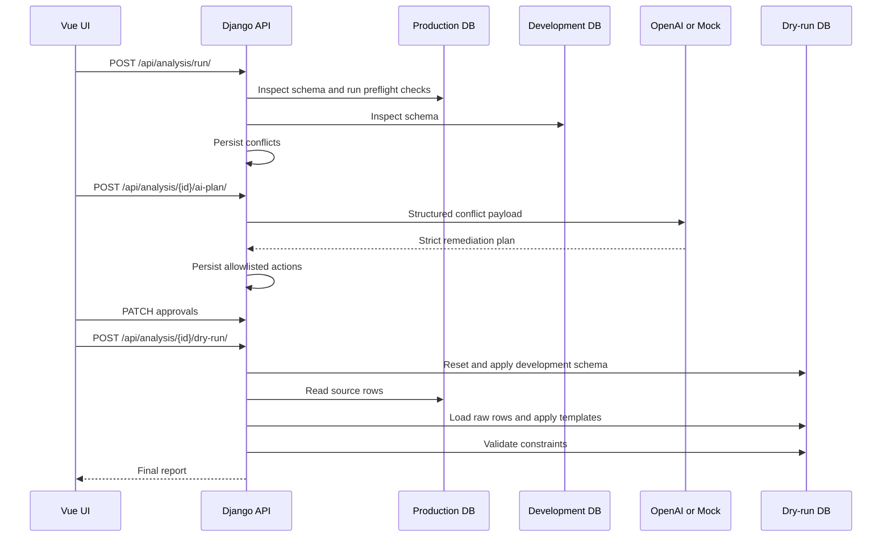

# Architecture

StageBridge AI is a monorepo with a Django REST backend, Vue frontend, Docker Compose infrastructure, and repeatable PostgreSQL demo databases.

## Backend

The backend lives in `backend/` and is split into small service modules:

- `schema_inspector.py` queries PostgreSQL catalogs and normalizes metadata.
- `diff_engine.py` performs deterministic schema comparison.
- `preflight.py` runs read-only production data checks with safe identifier composition.
- `ai_provider.py` calls OpenAI Responses API or the deterministic mock provider and validates the response with Pydantic.
- `actions.py` enforces the controlled action allowlist.
- `dry_run.py` resets `stagebridge_dryrun`, applies the development schema, loads raw production rows, applies approved transformations, validates constraints, and records logs.

Persisted Django models:

- `AnalysisRun`
- `Conflict`
- `RemediationPlan`
- `ApprovedAction`
- `DryRunLog`

## Data Flow

## Frontend

The frontend lives in `frontend/` and uses Vue 3, TypeScript, Vite, Pinia, Vue Router, Axios, and lucide icons. It includes:

- dashboard metrics;
- database topology;
- connection overview;
- new analysis entry point;
- conflict list and detail panel;
- AI recommendation panel;
- action approval controls;
- dry-run timeline;
- final report metrics.

## Infrastructure

`docker-compose.yml` starts:

- PostgreSQL 17 with seeded demo databases;
- Django backend on port `8000`;
- Vite preview frontend on port `5173`.

The PostgreSQL initialization script is `infrastructure/postgres/init/001-create-demo-databases.sql`.

