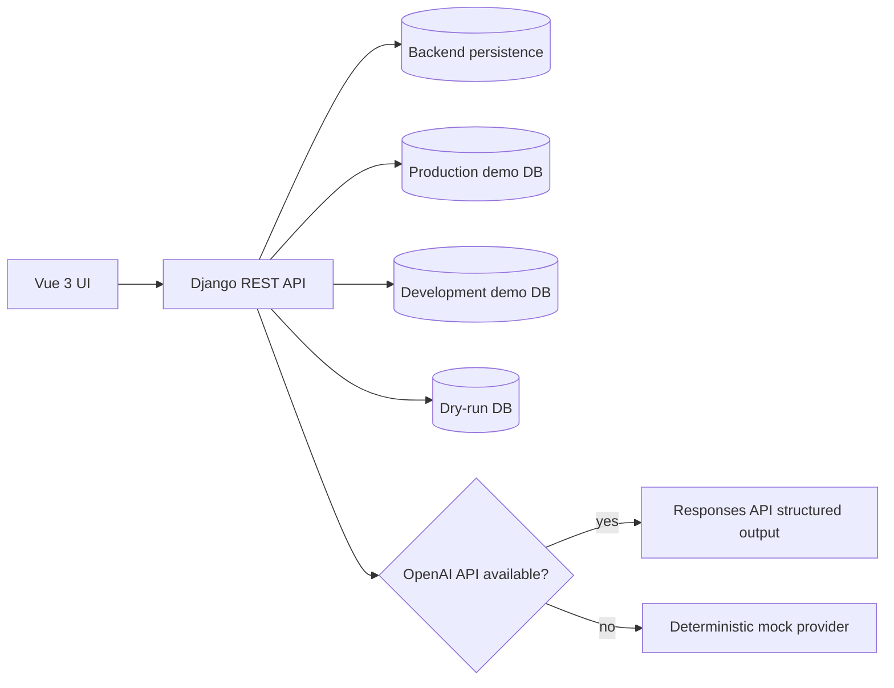

# StageBridge AI Implementation Plan

## Scope

Build a hackathon MVP that demonstrates PostgreSQL schema drift analysis and migration preflight validation across four demo databases:

- `stagebridge_prod` as read-only source data.
- `stagebridge_dev` as the newer schema source.
- `stagebridge_stage` as a named staging target placeholder.
- `stagebridge_dryrun` as an isolated execution target.

The MVP is intentionally scoped to the seeded demo schema and the supported conflict classes listed below. It is not a generic high-volume database migration product.

## Architecture

## Backend Modules

- Django models persist analysis runs, conflicts, remediation plans, approved actions, and dry-run logs.
- `schema_inspector` reads PostgreSQL metadata from `information_schema` and system catalogs.
- `diff_engine` compares normalized schema snapshots deterministically.
- `preflight` runs controlled read-only production checks with safe identifier quoting through `psycopg.sql`.
- `ai_provider` validates OpenAI or mock output with Pydantic structured models.
- `actions` enforces a strict remediation action allowlist and renders backend-controlled SQL previews.
- `dry_run` resets the isolated dry-run database, applies the development schema, loads raw production demo data, applies approved transformations, and validates results.

## Frontend Modules

- Vue Router screens for dashboard, connections, new analysis, and analysis detail.
- Pinia store coordinates API state.
- Components cover topology, metrics, conflict filters/details, AI recommendations, action approval, dry-run timeline, and report output.
- Vite proxy sends `/api` requests to Django during local development.

## Supported Conflicts

- Nullable to NOT NULL.
- Incompatible type change.
- Enum value mismatch.
- New foreign key with orphaned rows.
- New unique constraint with duplicates.
- Probable column rename.

## Safety Controls

- Production connections are opened read-only and with statement timeouts.
- AI output is advisory and validated with a strict Pydantic model.
- Unknown action types are rejected.
- SQL execution is generated only from backend-controlled templates.
- Production SQL is never destructive.
- Demo database host defaults are local/Docker-only.

## Verification Plan

- Backend: `pytest`, `python manage.py check`.
- Frontend: `npm run typecheck`, `npm run build`.
- Docker: `docker compose up --build` for PostgreSQL, backend, and frontend startup.
- Manual demo: run analysis, generate plan, approve actions, run dry run, inspect report.

